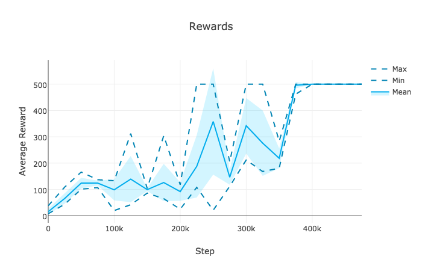

ACER
====

Actor-critic with experience replay (ACER) [[1]](#references). Uses batch off-policy updates to improve stability. Trust region updates can be enabled with `--trust-region`. Currently uses full trust region instead of "efficient" trust region (see [issue #1](https://github.com/Kaixhin/ACER/issues/1)).

Run with `python main.py <options>`. To run asynchronous advantage actor-critic (A3C) [[2]](#references) (but with a Q-value head), use the `--on-policy` option.

Requirements
------------

- [OpenAI Gym](https://gym.openai.com/)
- [Plotly](https://plot.ly/python/)
- [PyTorch](http://pytorch.org/)

To install all dependencies with Anaconda run `conda env create -f environment.yml` and use `source activate acer` to activate the environment.

Results
-------

Acknowledgements
----------------

- [@ikostrikov](https://github.com/ikostrikov) for [pytorch-a3c](https://github.com/ikostrikov/pytorch-a3c)
- [@apaszke](https://github.com/apaszke) for [Reinforcement Learning (DQN) tutorial](http://pytorch.org/tutorials/intermediate/reinforcement_q_learning.html)
- [@pfnet](https://github.com/pfnet) for [ChainerRL](https://github.com/pfnet/chainerrl)

References
----------

[1] [Sample Efficient Actor-Critic with Experience Replay](https://arxiv.org/abs/1611.01224)  
[2] [Asynchronous Methods for Deep Reinforcement Learning](https://arxiv.org/abs/1602.01783)  
